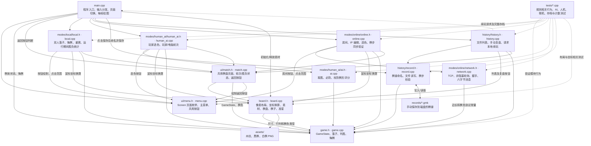
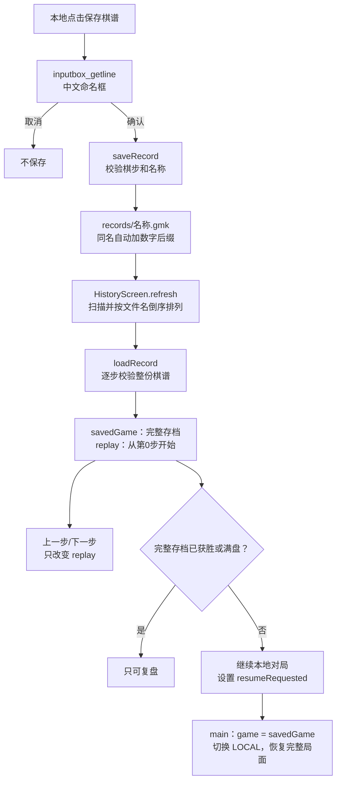

# 五子棋项目架构与阅读说明

这是一套 C++ / EGE 的 Windows 图形五子棋程序。主循环决定当前页面，三个对战模式共用落子规则与棋盘绘图。本地存档保存棋步，历史模块据此恢复棋局。网络使用单线程、非阻塞 TCP。

## 项目架构图

实线 A → B 表示 A 调用 B 的函数或依赖 B 的数据类型；虚线表示续玩请求传回主循环或测试关系。下面包含全部项目内部模块的直接调用和类型依赖，省略标准库之间的关系。间接包含的头文件无需再画重复箭头。



图中 `local` → `record` 没有直接箭头：本地模块负责判断是否点击保存按钮，`main.cpp` 弹出命名框并调用 `saveRecord()`。`history` → `local` 也没有直接箭头：历史模块只发出续玩请求，由 `main.cpp` 复制完整棋局并切换到本地模式。

EGE 由 `main`、`board`、`menu`、`match`、`local`、`human_ai`、`online`、`history` 使用。Windows 文件 API 由 `record` 和 `history` 使用，窗口/鼠标 API 由 `main` 和 `board` 使用；Winsock 与网卡查询 API 位于 `network`。这些是外部库依赖，不是项目内部模块。

## 推荐阅读顺序

1. [game.h](game.h)：先理解棋盘尺寸、`PieceColor`、`Move` 与 `GameState`。
2. [game.cpp](game.cpp)：看一次落子如何检查、记录、判胜、换人，以及悔棋如何恢复状态；鼠标坐标换算在 board.cpp。
3. [main.cpp](main.cpp)：看菜单、鼠标输入、页面切换和绘图循环如何串起模块。
4. [local.cpp](modes/local/local.cpp)：看本地模式及胜负计数，最容易理解。
5. [match.cpp](ui/match.cpp)、[board.cpp](board.cpp)、[menu.cpp](ui/menu.cpp)：看像素如何换算成行列、数据如何变成画面。
6. [record.cpp](history/record.cpp)、[history.cpp](history/history.cpp)：看保存、复盘与续玩。
7. [human_ai.cpp](modes/human_ai/human_ai.cpp)、[ai.cpp](modes/human_ai/ai.cpp)：看玩家回合和电脑评分。
8. [online.cpp](modes/online/online.cpp)、[network.cpp](modes/online/network.cpp)：最后阅读状态较多的联网逻辑。
9. `tests/`：用断言中的输入与预期结果理解各功能边界。

头文件 `.h` 主要声明类型和接口，`.cpp` 实现具体行为。每个非空代码行都带有中文注释；空行只是分段。已有说明注释继续保留。

## 一局棋的数据

| 数据 | 所在位置 | 用途及生命周期 |
|---|---|---|
| `board[13][13]` | `GameState` | 每个交点为空、黑棋或白棋，用于占位检查与判胜 |
| `currentPlayer` | `GameState` | 当前应该落子的棋色，黑棋先手；未获胜才切换 |
| `winner` | `GameState` | 空表示尚无赢家；黑或白表示获胜；和棋由满盘加无赢家判断 |
| `moves` | `GameState` | 按顺序存储行、列、棋色；供绘图、悔棋、保存和恢复使用 |
| `screen` | `main.cpp` | 当前页面；决定把输入交给哪个模块、绘制哪个页面 |
| `humanPiece` | `main.cpp` | 玩家在人机模式选择的棋色 |
| `winMessageShown` | `main.cpp` | 防止每帧重复弹出胜利提示，不等于胜负统计标记 |
| `localScore` | `main.cpp` | 本地累计黑胜、白胜、和棋及本局结算标记；关闭程序即消失 |
| `history.replay` | `HistoryScreen` | 当前复盘看到哪一步，可以前进或后退 |
| `history.savedGame` | `HistoryScreen` | 完整存档的最终棋局；续玩使用这个对象 |
| `history.resumeRequested` | `HistoryScreen` | 历史模块通知主循环切到本地续玩的标志 |
| `online.game` | `OnlineSession` | 联机专用棋局，与本地/人机共用的 `game` 分开 |
| `frame` | `main.cpp` | 800×600 离屏图像；完整一帧画好后整体贴到窗口，减少闪烁 |

`moves` 在内存中记录每一步并不等于保存棋谱。只有点击保存、确认命名并且文件写入成功，才会生成磁盘文件。

## 一次本地落子的流程

```mermaid
flowchart LR
    CLICK["鼠标左键按下"] --> DISPATCH["main：检查当前页面与按钮"]
    DISPATCH --> LOCAL["localMove"]
    LOCAL --> POS["mouseToBoard<br/>像素转行列"]
    POS --> PLACE["placePiece<br/>检查结束/越界/占位"]
    PLACE --> DATA["记录 moves 并更新 board"]
    DATA --> WIN["checkWin<br/>四方向向两侧累计"]
    WIN --> RESULT["胜则记 winner<br/>未胜则换 currentPlayer"]
    RESULT --> SCORE["updateLocalScore<br/>按本局结果结算一次"]
    SCORE --> DRAW["drawLocalGame → drawMatch<br/>按 moves 重画全部棋子"]
    DRAW --> POPUP["main：获胜后弹窗一次"]
```



重复落子或越界会返回失败，不追加棋步、不覆盖棋子，也不换人。`checkWin` 使用 `count >= 5`，所以六连子也判胜；不实现禁手规则。

## 本地计数为什么不会重复

`countedResult` 保存当前局已计入的结果：0 未结算、1 黑胜、2 白胜、3 和棋。如果新结果与标记相同，直接返回。结果发生变化时，先减去旧结果，再增加新结果。

因此，结束后悔棋会把结果变回0，并撤销本局统计；之后再次结束可以重新计入。`startLocalGame` 只清空当前棋盘和本局标记，保留其他对局的累计成绩。中途返回菜单没有胜负可计；历史复盘不调用本地结算。

## 手动保存、复盘与续玩



棋谱格式示例：

```text
WUZIQI 1
13
6 6 1
6 7 2
```

第一行是标识与格式版本；第二行是棋盘边长；后面每行是“行 列 颜色”。行列从0开始，颜色1为黑棋、2为白棋。存档不保存本地累计成绩，不保存人机玩家颜色或模式。当前只支持本地手动保存与本地续玩。

读取时重放所有棋步，自动得到当前轮次和赢家。因此无须单独存储棋盘数组。读取失败不会替换调用者已有棋步。任意复盘进度都不影响续玩：始终恢复 `savedGame`。

## 人机模式

玩家先选黑白。黑棋先下，所以选白时电脑自动走首手。玩家点击仅在人类回合有效。主循环每帧检查一次是否轮到电脑，电脑最多走一步。

AI 遍历所有空位，同时估计自己在该点的进攻价值和对手的威胁。比较顺序为：立即取胜优先；其次防止对手下一步取胜；再比较 `attack * 2 + defense`；完全平分时偏向棋盘中心。评分考虑连子数量、两端空位，以及包含候选点的五格窗口。它只做当前一步评分，不进行多层搜索。

## 联机模式

`OnlineSession` 管对局含义，`NetworkConnection` 管字节传输。两者不混用棋盘规则：收到合法棋步后仍调用 `placePiece`。

创建方默认监听 TCP 8888，加入方输入房主 IPv4。双方先连接、握手，再选色。房主统一确认双方颜色；同时选择时按房主已确认结果分配。未选色禁止落子。

| 协议字段 | 字节位置 | 含义 |
|---|---|---|
| 版本 | 0 | 当前为2 |
| 类型 | 1 | 0握手、1棋步、2选色请求、3房主确认 |
| 行/颜色/边长 | 2 | 棋步行号，或选色棋色，或握手棋盘边长 |
| 列 | 3 | 棋步列号；其他消息要求为0 |
| 步号高、低字节 | 4、5 | 棋步发生前已有棋步数，大端序；其他消息要求为0 |

每包固定六字节。TCP 一次接收可能只有半包，也可能包含多个包，因此 `incoming_` 先缓存，够六字节才解析。`outgoing_` 保存未发送完的字节，下次继续发送。连接或握手超过10秒失败，房主等待玩家加入没有超时。

网络层检查包格式与协议版本；业务层检查回合、棋色、步号和棋格。断线后停止本局，不支持网络断线续玩。输入框支持数字、点、退格、Delete、左右方向键、Home、End及Enter加入。

## 文件与构建

| 目录或文件 | 作用 |
|---|---|
| `assets/` | 程序启动必须能读取的三张 PNG 素材 |
| `records/` | 用户手动保存的 `.gmk`，不需要预先存在，保存时可创建 |
| `tests/` | 六组独立测试入口，各自包含 `main()`，不与游戏主入口一起编译 |
| `.vscode/tasks.json` | VS Code 的编译/运行任务，使用 MinGW g++ 和 EGE 库 |
| `.vscode/build-debug.ps1` | 把调试构建复制到临时的 ASCII 路径，绕开某些工具的中文路径问题 |
| `Makefile.win`、`wuziqi.dev` | Dev-C++ 项目与构建配置 |
| `*.o` | 编译中间产物，不是源码，不需要添加注释 |
| `wuziqi.exe` | 游戏主程序；发布时需要一起带上 `assets/` |

`drawModePlaceholder` 和 `clickedBack` 是保留的备用界面函数，当前主流程未使用。它们的存在不代表联机尚未实现。

## 看注释时需要区分的返回值

- `placePiece` / `saveRecord` / `loadRecord` 返回 true：操作成功。
- `historyClick` / `onlineClick` 返回 true：请求返回主菜单；返回 false 不一定是操作失败，也可能已经正常处理了页面内点击。
- `humanAiChoice` 返回 `PieceColor`：黑、白或未选中的 `EMPTY`。
- `inputbox_getline` 非零：确认输入；0：取消或无效输入。
- `draw...` 函数通常不返回结果：它们负责绘图，不应被理解为实际落子。

学习时优先读函数入口说明和关键状态变化，再读坐标、颜色和文件 API 细节。删除注释时应保留代码字符串中的内容，例如 `L"保存棋谱"`，不要把字符串中的符号误认为注释。
